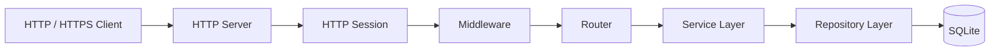

<div align="center">

# SecureCore

**A security-oriented server foundation built with modern C++20**

一个异步、安全、可测试的现代 C++ 服务端基础框架。


</div>

## 项目简介

SecureCore 是一个使用 C++20 编写的服务端学习与实践项目。

项目基于 Boost.Asio 和 Boost.Beast，实现异步 HTTP/HTTPS 服务、
身份认证、细粒度 RBAC、审计日志、数据库连接池、优雅关闭以及完整的
Sanitizer、Fuzzer 和 CI 测试体系。

## 核心特性

- 异步 HTTP 与 HTTPS 服务
- 路由和中间件系统
- Argon2id 密码哈希
- Access Token 与 Refresh Token
- 细粒度 RBAC 权限控制
- SQLite 数据库和连接池
- 安全审计日志
- ASan、UBSan 和 TSan
- 6 个 libFuzzer 目标
- GitHub Actions 自动测试
- 可复现 Release 构建

## 快速开始

```bash
git clone https://github.com/Bandiaozia/SecureCore.git
cd SecureCore

cmake -S . -B build \
    -DCMAKE_BUILD_TYPE=Debug

cmake --build build -j4

ctest \
    --test-dir build \
    --output-on-failure

./build/secure-server configs/server.conf
```

默认开发配置仅监听 `127.0.0.1:9090`，并显式开启账户注册。生产部署请复制
`configs/server.production.conf.example`，配置 TLS、CORS 和文件路径；生产示例
默认关闭公开注册，并保护 `/metrics`。

主要认证端点：

```text
POST /v1/auth/register
POST /v1/auth/login
POST /v1/auth/refresh
POST /v1/auth/logout
POST /v1/auth/logout-all
```

详细配置、安全边界和测试方式见 `configs/CONFIGURATION.md` 与 `docs/`。

## 项目架构



## 查看版本

```bash
./build/secure-server --version
./build/secure-admin --version
```

## 安全与许可证

安全问题请按照 `SECURITY.md` 私下报告。项目采用 MIT License，详见
`LICENSE`。
